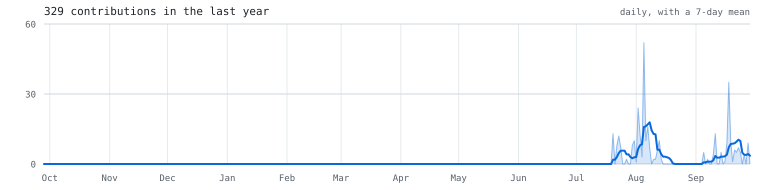

<picture>
  <source media="(prefers-color-scheme: dark)" srcset="assets/banner-dark.svg" />
  
</picture>

Computer science student building small, focused tools in Python: developer
tooling, research-analysis utilities and one Android app. I try to make each
one genuinely usable rather than a demo, so every project has a test suite and
a README that explains both how it works and where it falls short, and the
Python ones run their tests in GitHub Actions on every push.

---

### Featured

**[Clearlane](https://github.com/ShezinKhais/clearlane)**

An Android routing app that looks for the least congested way to a destination
instead of the quickest one, and tells you exactly what the calm route costs in
minutes. Built for the UAE, where five motorways run the same direction a few
kilometres apart and a routing API asked for alternatives will never offer you
the far one. Includes a driving screen with speed against the posted limit and
warnings from 1,566 real camera positions, plus a congestion model, a drive
score, and Salik tariff windows. 102 tests across the pure-Kotlin modules.

*Kotlin · Jetpack Compose · MapLibre · routing and congestion modelling*

**[CodeCartographer](https://github.com/ShezinKhais/codecartographer)** &nbsp;·&nbsp; [live demo](https://shezinkhais.github.io/codecartographer/) &nbsp;·&nbsp; 

Static analysis for Python codebases: module dependency graphs, circular-import
detection via Tarjan's strongly connected components, a static call graph, and
dead-code detection. No runtime dependencies, and the graph algorithms are
implemented from scratch. It generates a self-contained HTML report, with the
import map, the findings as readable prose, and a view that traces how execution
reaches any function you name.

*Python · AST · graph algorithms · zero dependencies*

**[HarmonicDNA](https://github.com/ShezinKhais/harmonicDNA)** &nbsp;·&nbsp; 

Applies Smith-Waterman local alignment, the bioinformatics algorithm for
comparing DNA sequences, to chord progressions extracted from audio. Two songs
in, out comes a similarity score and a visual alignment of the passages that are
most harmonically alike.

*Python · signal processing · sequence alignment*

---

### In progress

**[EchoLock](https://github.com/ShezinKhais/echolock)** &nbsp;·&nbsp; 

A voice-and-passphrase unlock overlay. The MFCC speaker-verification pipeline is
implemented from scratch on numpy, paired with a passphrase that rotates daily
and is checked by an offline speech recognizer. No pretrained speaker model and
no cloud calls. The README documents the measured tradeoffs behind the scoring
function and threshold, including the approach that looked safe and was not.

*Python · signal processing · speaker verification*

**[C.L.I.P](https://github.com/ShezinKhais/Cognitive_Learning_Intelligence_Platform)** &nbsp;·&nbsp; 

Team capstone (CSIT321, University of Wollongong in Dubai). A Microsoft Teams app
that generates comprehension checkpoints from a lecturer's own slides and surfaces
real-time engagement, without ever storing video, audio, or transcripts.

*FastAPI · React · PostgreSQL · local LLM inference*

---

### Other projects

| Project | What it does |
|---|---|
| [claimaudit](https://github.com/ShezinKhais/claimaudit) | Tracks whether a paper's empirical claims are later confirmed, challenged, or extended by the work that cites them. |
| [Hypothesisgraveyard](https://github.com/ShezinKhais/Hypothesisgraveyard) | Finds scientific hypotheses that were published and then never meaningfully engaged with by later citations. |
| [argumentminer](https://github.com/ShezinKhais/argumentminer) | Extracts claims, premises, and the phrasing of eight logical fallacies from argumentative text, and lays the structure out as a readable report. |
| [federated-aml](https://github.com/ShezinKhais/federated-aml) | Federated Averaging (FedAvg) for fraud detection across simulated banks: models train locally, only weights are shared. |

---

### How these are built

Standard-library-first where practical, small dependency footprints, pytest
suites, and GitHub Actions CI on every push. The tools that depend on external
APIs ship an offline demo mode so they run from a fresh clone with no setup.

---

<picture>
  <source media="(prefers-color-scheme: dark)" srcset="assets/activity-dark.svg" />
  
</picture>
